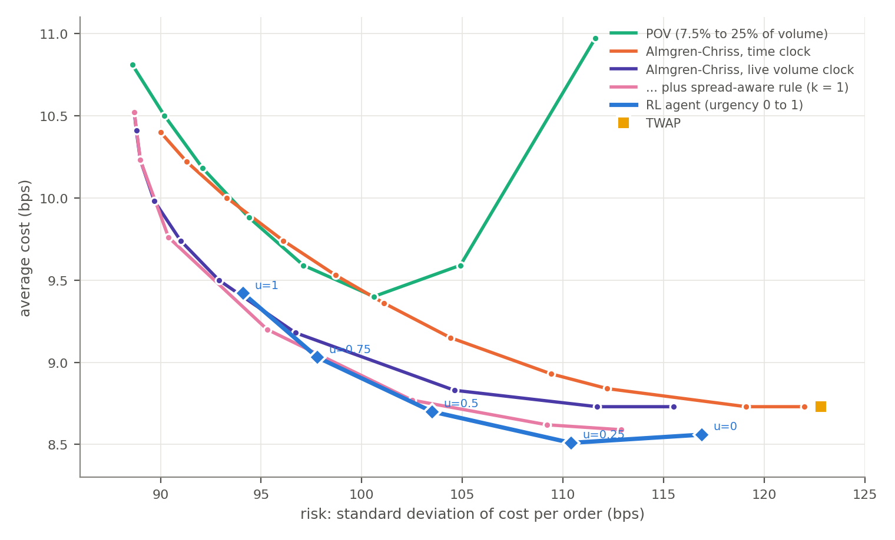

# RL Optimal Execution

A reinforcement learning agent for institutional order execution: split a
large order across the trading day to trade off market-impact cost against
price risk. Trained in a limit-order-book simulator calibrated on two years
of US large-cap tick data, and compared with tuned classical strategies.

> **Correction.** Earlier versions of this project (and a LinkedIn post)
> reported ~27% savings vs TWAP and ~30% vs Almgren-Chriss. Those figures
> were artefacts of a flawed cost metric and a flawed impact model. See
> `PROJECT_AUDIT.md` §2–3.

## Result

13 tickers, 488 trading days, orders of 5% of ADV. 4 walk-forward periods ×
3 independently trained policies; each tested only on its own unseen period.
Cost = signed implementation shortfall (bps). Because the agent has an
urgency dial that trades cost for risk, it is compared with each classical
strategy **at the same risk**.

| Urgency | vs best classical | vs best schedule (no spread rule) | vs Almgren-Chriss (time clock) |
|---|---|---|---|
| 0 | −0.04 (tie) | −0.18 | −0.22 |
| 0.25 | −0.11 | −0.25 | −0.41 |
| 0.5 | −0.08 | −0.21 | −0.52 |
| 0.75 | −0.01 (tie) | −0.11 | −0.56 |
| 1 | +0.07 (tie) | +0.01 (tie) | −0.50 |

bps; negative = agent cheaper. "Best classical" is the cheapest, at that
risk, of Almgren-Chriss on a time clock, on an expected-volume clock, on a
live-volume clock, the latter with a spread-aware rule, and POV — each swept
over its parameter. 95% intervals (day-clustered bootstrap) are in the audit.

**The agent matches the strongest classical strategy and beats every
schedule that ignores the quoted spread.** It uses only information a real
trader has (current quote, recent volatility, recent volume) and runs with a
standard schedule guardrail.

## What this project is really about

Most of the work was finding out why early results were too good. Each
problem below was found, measured and fixed:

| Problem | Effect on the reported edge |
|---|---|
| Cost metric ignored favourable price moves | ~27% → a few bps |
| Permanent impact charged per fill, not per order | a few bps → slightly worse than Almgren-Chriss |
| Almgren-Chriss benchmark was mathematically TWAP | overstated AC comparison |
| Reward was not the scored objective | — |
| Clipped action space; agent idle 28% of minutes | +0.8 → +0.14 bps from the optimum |
| Resting orders modelled too generously | spurious −2.5 bps |
| Agent could see hidden simulator state | most of a −0.3 bps edge |
| Best checkpoint chosen on test data | model selection leakage |

Details, with every number: `PROJECT_AUDIT.md`.

## Architecture

- `simulator/` — limit order book, Hawkes order flow, regime switching,
  multi-factor impact model (temporary impact vs live minute volume;
  cumulative square-root permanent impact)
- `agent/` — Gymnasium environment, PPO (Stable-Baselines3), mean-variance
  reward, squashed participation-rate action
- `evaluation/` — paired evaluation, benchmark sweeps, equal-risk frontier
  comparison, day-clustered bootstrap, walk-forward, diagnostics

## Running it

See `PROJECT_AUDIT.md` §8. Market data is licensed (Databento) and not
included; `evaluation/fetch_tick_data.py` pulls it given an API key.

## Limitations

Synthetic simulator, calibrated from real data but never run against replayed
order flow. Calibration used the full dataset including test periods. The
edge over pure schedules depends on simulated spread variation that is not
yet calibrated. Results are relative comparisons within the simulator. Full
list in `PROJECT_AUDIT.md` §6.
